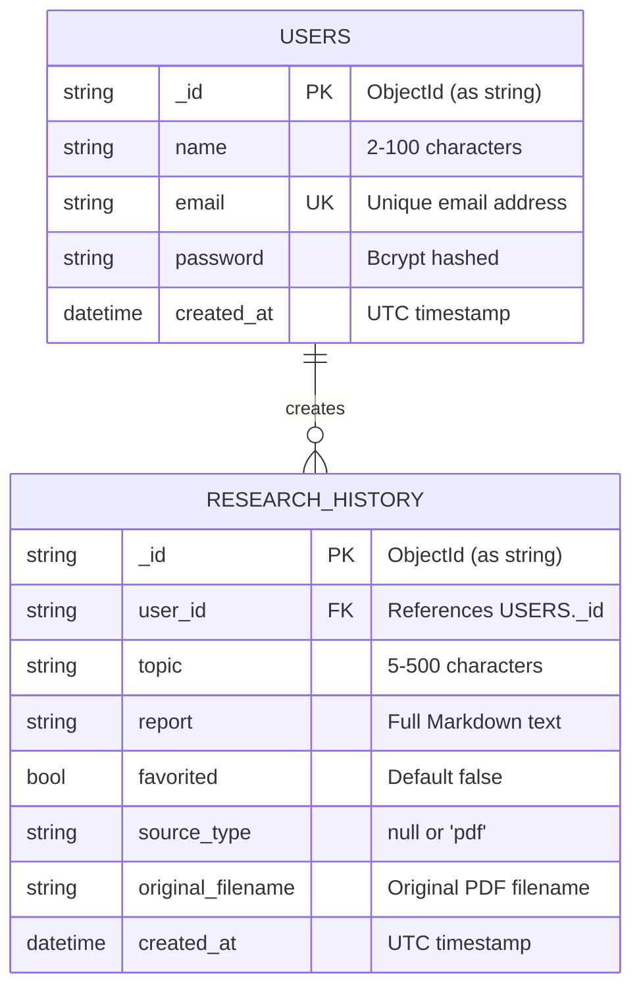

<div align="center">

# 🤖 AI Research Assistant

### A Full-Stack Multi-Agent AI Application

**Powered by CrewAI, FastAPI, React, and Google Gemini**

---


---

Enter any research topic and watch **three AI agents** collaborate to produce a professional, structured research report — in minutes.

</div>

---

## 📑 Table of Contents

- [Features](#-features)
- [Tech Stack](#-tech-stack)
- [Project Structure](#-project-structure)
- [Database Schema (ER Diagram)](#-database-schema-er-diagram)
- [API Endpoints](#-api-endpoints)
- [CRUD Operations](#-crud-operations)
- [Authentication Flow](#-authentication-flow)
- [AI Agent Pipeline](#-ai-agent-pipeline)
- [Getting Started](#-getting-started)
- [Environment Variables](#-environment-variables)
- [Deployment](#-deployment)
- [Screenshots](#-screenshots)

---

## ✨ Features

| Feature | Description |
|---------|-------------|
| 🔐 **JWT Authentication** | Secure user registration and login with bcrypt password hashing |
| 🤖 **Multi-Agent AI** | 3 specialized CrewAI agents working in sequence |
| 📊 **Animated Pipeline** | Real-time visual progress of the AI agent workflow |
| 📝 **Markdown Reports** | Professional reports with copy-to-clipboard and download |
| 📜 **Research History** | View, manage, and delete past research reports |
| 📱 **Responsive Design** | Mobile-friendly UI with sidebar navigation |
| 🎨 **Modern UI** | Clean design with Tailwind CSS custom color system |
| ⚡ **Non-Blocking AI** | CrewAI runs in a background thread — API stays responsive |
| 📄 **PDF Analysis** | Upload any PDF — text is extracted and analyzed by AI agents |
| 💬 **Follow-Up Questions** | Chat-based Q&A on any generated report |
| ⭐ **Favorites & Search** | Star reports for quick access; search history by topic |

---

## 🛠 Tech Stack

```
┌─────────────────────────────────────────────────────────┐
│                     FRONTEND                             │
│  React 18 · React Router 6 · Tailwind CSS · Vite       │
│  Axios · React Markdown · React Hot Toast · React Icons │
├─────────────────────────────────────────────────────────┤
│                     BACKEND                              │
│  FastAPI · Uvicorn · Pydantic · Motor (async MongoDB)  │
│  python-jose (JWT) · passlib/bcrypt · PyMuPDF           │
├─────────────────────────────────────────────────────────┤
│                     AI LAYER                             │
│  Google Gemini (direct REST API)                              │
├─────────────────────────────────────────────────────────┤
│                    DATABASE                              │
│  MongoDB (via Motor async driver)                       │
├─────────────────────────────────────────────────────────┤
│                   DEPLOYMENT                             │
│  Vercel (Frontend) · Render (Backend) · MongoDB Atlas   │
└─────────────────────────────────────────────────────────┘
```

---

## 📁 Project Structure

```
AI-Research-Assistant/
│
├── backend/
│   ├── run.py                          # Uvicorn entry point
│   ├── start_server.py                 # Debug entry point
│   ├── requirements.txt                # Python dependencies
│   ├── .env.example                    # Environment template
│   ├── render.yaml                     # Render deployment config
│   │
│   └── app/
│       ├── main.py                     # FastAPI app + CORS + lifespan
│       ├── config.py                   # Pydantic settings from .env
│       │
│       ├── database/
│       │   └── __init__.py             # Motor MongoDB connection
│       │
│       ├── models/
│       │   ├── user.py                 # UserCreate, UserLogin, TokenResponse
│       │   └── research.py             # ResearchRequest, ResearchResponse, FollowUp*
│       │
│       ├── routes/
│       │   ├── auth.py                 # Register, Login, Profile
│       │   ├── research.py             # Create, History, Favorite, FollowUp, Delete
│       │   └── pdf.py                  # PDF upload & analyze
│       │
│       ├── agents/
│       │   └── research_agents.py      # 3 CrewAI agent definitions (unused)
│       │
│       ├── tasks/
│       │   └── research_tasks.py       # 3 CrewAI task definitions (unused)
│       │
│       ├── crew/
│       │   └── research_crew.py        # Direct Gemini REST pipeline (2-step)
│       │
│       ├── services/
│       │   └── __init__.py             # (empty)
│       │
│       └── utils/
│           ├── auth.py                 # JWT + bcrypt utilities
│           └── dependencies.py         # get_current_user dependency
│
├── frontend/
│   ├── package.json                    # npm dependencies
│   ├── vite.config.js                  # Vite + API proxy
│   ├── tailwind.config.js              # Custom theme colors
│   ├── vercel.json                     # Vercel deployment config
│   ├── index.html                      # HTML shell
│   ├── postcss.config.js               # PostCSS config
│   │
│   └── src/
│       ├── App.jsx                     # Router + route guards
│       ├── main.jsx                    # React DOM mount
│       ├── index.css                   # Tailwind directives + base styles
│       │
│       ├── components/
│       │   ├── Navbar.jsx              # Responsive top navigation
│       │   ├── Sidebar.jsx             # Desktop sidebar navigation
│       │   ├── ReportViewer.jsx        # Markdown report display
│       │   ├── StatusCard.jsx          # Dashboard metric card
│       │   ├── LoadingSpinner.jsx      # Animated loading state
│       │   └── FollowUpChat.jsx        # Follow-up question chat UI
│       │
│       ├── pages/
│       │   ├── Landing.jsx             # Public landing page
│       │   ├── Login.jsx               # Login form
│       │   ├── Register.jsx            # Registration form
│       │   ├── Dashboard.jsx           # Auth user dashboard
│       │   ├── Research.jsx            # Research submission + pipeline + follow-up
│       │   ├── History.jsx             # Past reports list with search & favorites
│       │   ├── PdfUpload.jsx           # Drag-and-drop PDF upload + analysis
│       │   └── Profile.jsx             # User profile display
│       │
│       ├── hooks/
│       │   ├── useAuth.jsx             # Auth context + provider
│       │   └── useResearch.jsx         # Research CRUD + favorites + follow-up hook
│       │
│       └── services/
│           └── api.js                  # Axios instance + auth interceptor + API calls
│
└── AGENTS.md                           # AI agents documentation
```

---

## 🗄 Database Schema (ER Diagram)

### Entity Relationship Diagram



### Collection: `users`

| Field | Type | Constraints | Description |
|-------|------|-------------|-------------|
| `_id` | `string` | Primary Key | Auto-generated ObjectId as string |
| `name` | `string` | Min 2, Max 100 | User's display name |
| `email` | `string` | Unique, Email format | Login identifier |
| `password` | `string` | Min 6 (before hash) | Bcrypt-hashed password |
| `created_at` | `datetime` | Auto-set | Account creation timestamp |

### Collection: `research_history`

| Field | Type | Constraints | Description |
|-------|------|-------------|-------------|
| `_id` | `string` | Primary Key | Auto-generated ObjectId as string |
| `user_id` | `string` | Foreign Key → users._id | Owner of this report |
| `topic` | `string` | Min 5, Max 500 | Research topic entered by user |
| `report` | `string` | — | Full Markdown report from AI |
| `favorited` | `bool` | Default `false` | Starred for quick access |
| `source_type` | `string?` | `null` or `"pdf"` | Identifies PDF-sourced reports |
| `original_filename` | `string?` | — | Original name of uploaded PDF |
| `created_at` | `datetime` | Auto-set | Report generation timestamp |

---

## 🔌 API Endpoints

### Authentication

| Method | Endpoint | Auth | Description |
|--------|----------|:----:|-------------|
| `POST` | `/api/auth/register` | ❌ | Register a new user |
| `POST` | `/api/auth/login` | ❌ | Login and receive JWT |
| `GET` | `/api/auth/profile` | ✅ | Get current user profile |

### Research

| Method | Endpoint | Auth | Description |
|--------|----------|:----:|-------------|
| `POST` | `/api/research/create` | ✅ | Generate a new AI research report |
| `GET` | `/api/research/history?search=` | ✅ | List reports (optional regex search) |
| `POST` | `/api/research/favorite/{id}` | ✅ | Toggle favorite status |
| `POST` | `/api/research/followup` | ✅ | Ask a follow-up question on a report |
| `DELETE` | `/api/research/{id}` | ✅ | Delete a specific report |

### PDF Analysis

| Method | Endpoint | Auth | Description |
|--------|----------|:----:|-------------|
| `POST` | `/api/pdf/analyze` | ✅ | Upload PDF (max 10MB) for AI analysis |

### Health Check

| Method | Endpoint | Auth | Description |
|--------|----------|:----:|-------------|
| `GET` | `/` | ❌ | API health check |

### Request / Response Examples

**Register:**
```json
// POST /api/auth/register
// Request:
{
  "name": "John Doe",
  "email": "john@example.com",
  "password": "secret123"
}

// Response: 200
{
  "access_token": "eyJhbGciOiJIUzI1NiIs...",
  "token_type": "bearer",
  "user": {
    "id": "6650a1b2c3d4e5f6a7b8c9d0",
    "name": "John Doe",
    "email": "john@example.com",
    "created_at": "2026-07-25T10:30:00Z"
  }
}
```

**Create Research:**
```json
// POST /api/research/create
// Headers: Authorization: Bearer <token>
// Request:
{
  "topic": "The impact of AI on modern healthcare"
}

// Response: 200
{
  "id": "6650a1b2c3d4e5f6a7b8c9d1",
  "user_id": "6650a1b2c3d4e5f6a7b8c9d0",
  "topic": "The impact of AI on modern healthcare",
  "report": "# Executive Summary\n\nAI is transforming...",
  "created_at": "2026-07-25T10:32:15Z"
}
```

---

## ⚙️ CRUD Operations

### Complete CRUD Flow Diagram

```
┌──────────────────────────────────────────────────────────────┐
│                     USER AUTH CRUD                            │
├──────────────────────────────────────────────────────────────┤
│                                                              │
│  CREATE (Register)                                           │
│  ┌─────────────────┐    ┌──────────────┐    ┌────────────┐  │
│  │ Frontend Form   │───▶│ POST         │───▶│ MongoDB    │  │
│  │ name, email, pw │    │ /auth/register│    │ users col  │  │
│  └─────────────────┘    └──────────────┘    └────────────┘  │
│                                         ↓                    │
│                                  JWT Token returned          │
│                                                              │
│  READ (Login + Profile)                                     │
│  ┌─────────────────┐    ┌──────────────┐    ┌────────────┐  │
│  │ Email + Password│───▶│ POST         │───▶│ Find user  │  │
│  │                 │    │ /auth/login   │    │ by email   │  │
│  └─────────────────┘    └──────────────┘    └────────────┘  │
│                                         ↓                    │
│                                  Verify bcrypt hash          │
│                                  Return JWT + user data      │
│                                                              │
│  ┌─────────────────┐    ┌──────────────┐    ┌────────────┐  │
│  │ Bearer Token    │───▶│ GET          │───▶│ Find user  │  │
│  │                 │    │ /auth/profile │    │ by _id     │  │
│  └─────────────────┘    └──────────────┘    └────────────┘  │
│                                         ↓                    │
│                                  Return user profile         │
└──────────────────────────────────────────────────────────────┘

┌──────────────────────────────────────────────────────────────┐
│                   RESEARCH REPORT CRUD                        │
├──────────────────────────────────────────────────────────────┤
│                                                              │
│  CREATE (Generate Report)                                    │
│  ┌─────────────────┐    ┌──────────────┐    ┌────────────┐  │
│  │ Topic String    │───▶│ POST         │───▶│ Gemini     │  │
│  │                 │    │ /research/    │    │ 2-step     │  │
│  │                 │    │ create        │    │ pipeline   │  │
│  └─────────────────┘    └──────────────┘    └────────────┘  │
│                                         ↓                    │
│                                  Markdown report generated   │
│                                         ↓                    │
│                                  ┌────────────────────┐      │
│                                  │ Save to MongoDB    │      │
│                                  │ research_history   │      │
│                                  └────────────────────┘      │
│                                         ↓                    │
│                                  Return report to frontend   │
│                                                              │
│  READ (Get History)                                         │
│  ┌─────────────────┐    ┌──────────────┐    ┌────────────┐  │
│  │ Bearer Token    │───▶│ GET          │───▶│ Find all   │  │
│  │ (+ ?search=)   │    │ /research/    │    │ where      │  │
│  │                 │    │ history       │    │ user_id =  │  │
│  └─────────────────┘    └──────────────┘    │ current    │  │
│                                         ↓    │ user       │  │
│                                  Return sorted array    │      │
│                                  (newest first, filtered)│     │
│                                  └────────────┘               │
│                                                              │
│  UPDATE (Toggle Favorite)                                    │
│  ┌─────────────────┐    ┌──────────────┐    ┌────────────┐  │
│  │ Report ID       │───▶│ POST         │───▶│ Flip       │  │
│  │                 │    │ /research/    │    │ favorited  │  │
│  │                 │    │ favorite/{id} │    │ boolean    │  │
│  └─────────────────┘    └──────────────┘    └────────────┘  │
│                                         ↓                    │
│                                  Return {favorited: bool}    │
│                                                              │
│  DELETE (Remove Report)                                      │
│  ┌─────────────────┐    ┌──────────────┐    ┌────────────┐  │
│  │ Report ID       │───▶│ DELETE       │───▶│ Delete     │  │
│  │                 │    │ /research/   │    │ where      │  │
│  │                 │    │ {id}          │    │ _id = id   │  │
│  └─────────────────┘    └──────────────┘    │ AND        │  │
│                                         ↓    │ user_id =  │  │
│                                  Confirm      │ current    │  │
│                                  deleted      │ user       │  │
│                                              └────────────┘  │
└──────────────────────────────────────────────────────────────┘

┌──────────────────────────────────────────────────────────────┐
│                     PDF ANALYSIS                              │
├──────────────────────────────────────────────────────────────┤
│                                                              │
│  CREATE (Analyze PDF)                                        │
│  ┌─────────────────┐    ┌──────────────┐    ┌────────────┐  │
│  │ PDF File        │───▶│ POST         │───▶│ PyMuPDF    │  │
│  │ (multipart)     │    │ /pdf/analyze  │    │ extract    │  │
│  └─────────────────┘    └──────────────┘    │ text       │  │
│                                         ↓    └────────────┘  │
│                                  ┌────────────────────┐      │
│                                  │ Gemini pipeline    │      │
│                                  │ (same 2-step as    │      │
│                                  │  text research)    │      │
│                                  └────────────────────┘      │
│                                         ↓                    │
│                                  ┌────────────────────┐      │
│                                  │ Save with          │      │
│                                  │ source_type="pdf"  │      │
│                                  │ original_filename   │      │
│                                  └────────────────────┘      │
│                                         ↓                    │
│                                  Return report to frontend   │
└──────────────────────────────────────────────────────────────┘

┌──────────────────────────────────────────────────────────────┐
│                   FOLLOW-UP QUESTIONS                         │
├──────────────────────────────────────────────────────────────┤
│                                                              │
│  CREATE (Ask Follow-Up)                                      │
│  ┌─────────────────┐    ┌──────────────┐    ┌────────────┐  │
│  │ Topic + Report  │───▶│ POST         │───▶│ Gemini     │  │
│  │ + Question      │    │ /research/    │    │ answers    │  │
│  └─────────────────┘    │ followup      │    │ based on   │  │
│                         └──────────────┘    │ report     │  │
│                                         ↓    └────────────┘  │
│                                  Return {answer: string}     │
└──────────────────────────────────────────────────────────────┘
```

### CRUD Summary Table

| Operation | Collection | Method | Endpoint | Input | Output |
|-----------|-----------|--------|----------|-------|--------|
| **Create User** | `users` | POST | `/api/auth/register` | `{name, email, password}` | `{token, user}` |
| **Read User** | `users` | POST | `/api/auth/login` | `{email, password}` | `{token, user}` |
| **Read Profile** | `users` | GET | `/api/auth/profile` | Bearer token | `{user}` |
| **Create Report** | `research_history` | POST | `/api/research/create` | `{topic}` | `{report}` |
| **Read Reports** | `research_history` | GET | `/api/research/history?search=` | Bearer token | `[{report}]` |
| **Toggle Favorite** | `research_history` | POST | `/api/research/favorite/{id}` | Bearer token | `{favorited}` |
| **Follow-Up** | — | POST | `/api/research/followup` | `{topic, report, question}` | `{answer}` |
| **Analyze PDF** | `research_history` | POST | `/api/pdf/analyze` | PDF file (multipart) | `{report}` |
| **Delete Report** | `research_history` | DELETE | `/api/research/{id}` | Bearer token | `{message}` |

---

## 🔐 Authentication Flow

```
┌────────────────────────────────────────────────────────┐
│                  AUTHENTICATION FLOW                     │
├────────────────────────────────────────────────────────┤
│                                                        │
│   REGISTER                                             │
│   ┌────────┐  ┌─────────┐  ┌──────┐  ┌──────────┐    │
│   │ User   │─▶│ Hash    │─▶│ Save │─▶│ Generate │    │
│   │ inputs │  │ bcrypt  │  │ to   │  │ JWT      │    │
│   │ name,  │  │ password│  │ DB   │  │ token    │    │
│   │ email, │  │         │  │      │  │          │    │
│   │ pass   │  │         │  │      │  │          │    │
│   └────────┘  └─────────┘  └──────┘  └──────────┘    │
│                                              │         │
│                                    Return token + user │
│                                                        │
│   LOGIN                                                │
│   ┌────────┐  ┌─────────┐  ┌──────┐  ┌──────────┐    │
│   │ User   │─▶│ Find    │─▶│ Verify│─▶│ Generate │    │
│   │ email, │  │ user by │  │ bcrypt│  │ JWT      │    │
│   │ pass   │  │ email   │  │ match │  │ token    │    │
│   └────────┘  └─────────┘  └──────┘  └──────────┘    │
│                                              │         │
│                                    Return token + user │
│                                                        │
│   PROTECTED REQUEST                                    │
│   ┌────────┐  ┌─────────┐  ┌──────┐  ┌──────────┐    │
│   │ Client │─▶│ Extract │─▶│ Decode│─▶│ Fetch    │    │
│   │ sends  │  │ Bearer  │  │ JWT   │  │ user     │    │
│   │ token  │  │ token   │  │ sub   │  │ from DB  │    │
│   └────────┘  └─────────┘  └──────┘  └──────────┘    │
│                                              │         │
│                                    Return user data    │
│                                                        │
│   TOKEN DETAILS                                        │
│   • Algorithm: HS256                                   │
│   • Secret: JWT_SECRET_KEY (from .env)                 │
│   • Expiry: 60 minutes (configurable)                  │
│   • Payload: {"sub": user_id, "exp": datetime}         │
│                                                        │
│   SECURITY                                             │
│   • Passwords: bcrypt hashing via passlib              │
│   • Tokens: python-jose with HS256                     │
│   • Frontend: Axios interceptor attaches Bearer token  │
│   • 401 handling: Auto-logout + redirect to /login     │
│                                                        │
└────────────────────────────────────────────────────────┘
```

---

## 🤖 AI Agent Pipeline

```
┌──────────────────────────────────────────────────────────────┐
│                   GEMINI RESEARCH PIPELINE                    │
├──────────────────────────────────────────────────────────────┤
│                                                              │
│   USER INPUT                                                 │
│   "The impact of AI on modern healthcare"                    │
│         │                                                    │
│         ▼                                                    │
│   ┌─────────────────────────────────────────┐                │
│   │  STEP 1: RESEARCH (single Gemini call)  │                │
│   │  ────────────────────────────────────    │                │
│   │  Prompt: Research Strategist persona    │                │
│   │  • Key facts and definitions            │                │
│   │  • Statistics and data points           │                │
│   │  • Expert opinions and viewpoints       │                │
│   │  • Real-world examples and case studies │                │
│   │  • Current trends and developments      │                │
│   │  • Challenges and limitations           │                │
│   │  • Future prospects                     │                │
│   │  Output: Research Findings              │                │
│   └─────────────────────────────────────────┘                │
│         │                                                    │
│         ▼                                                    │
│   ┌─────────────────────────────────────────┐                │
│   │  STEP 2: WRITING (single Gemini call)   │                │
│   │  ────────────────────────────────────    │                │
│   │  Prompt: Skilled Writer persona         │                │
│   │  • Executive Summary                    │                │
│   │  • Introduction                         │                │
│   │  • Key Findings (### subsections)       │                │
│   │  • Analysis & Discussion                │                │
│   │  • Conclusion                           │                │
│   │  • Recommendations                      │                │
│   │  Output: Professional Markdown Report   │                │
│   └─────────────────────────────────────────┘                │
│         │                                                    │
│         ▼                                                    │
│   FINAL REPORT (Markdown)                                    │
│   • Saved to MongoDB                                         │
│   • Displayed with React Markdown                            │
│   • Copy to clipboard / Download as .md / Print as PDF      │
│   • Follow-up chat available on every report                 │
│                                                              │
│   LLM: Google Gemini (temperature: 0.7)                        │
│   Execution: Direct REST API via urllib in asyncio.to_thread │
│   Retry: Up to 4 attempts with exponential backoff on 429   │
│                                                              │
└──────────────────────────────────────────────────────────────┘
```

---

## 🚀 Getting Started

### Prerequisites

- **Python 3.10+**
- **Node.js 18+**
- **MongoDB** running locally or MongoDB Atlas URI
- **Google Gemini API key** from [Google AI Studio](https://aistudio.google.com/apikey)

### Backend Setup

```bash
# Navigate to backend
cd backend

# Create virtual environment
python -m venv venv

# Activate it
venv\Scripts\activate          # Windows
# source venv/bin/activate    # macOS/Linux

# Install dependencies
pip install -r requirements.txt

# Create .env from template
copy .env.example .env         # Windows
# cp .env.example .env        # macOS/Linux

# Edit .env with your keys (see Environment Variables below)

# Start the server
python run.py
```

Backend runs at **http://localhost:8000**  
API docs at **http://localhost:8000/docs**

### Frontend Setup (new terminal)

```bash
# Navigate to frontend
cd frontend

# Install dependencies
npm install

# Start dev server
npm run dev
```

Frontend runs at **http://localhost:5173**

### Usage

1. Open `http://localhost:5173`
2. Click **Get Started Free** → create an account
3. Go to **New Research**
4. Enter a topic (e.g., "The impact of AI on modern healthcare")
5. Watch the AI agents work
6. View, copy, or download your report

---

## 🔧 Environment Variables

### Backend (`backend/.env`)

| Variable | Required | Default | Description |
|----------|:--------:|---------|-------------|
| `MONGODB_URL` | ✅ | `mongodb://localhost:27017` | MongoDB connection string |
| `DATABASE_NAME` | ❌ | `ai_research_assistant` | Database name |
| `JWT_SECRET_KEY` | ✅ | — | Secret key for JWT signing |
| `JWT_ALGORITHM` | ❌ | `HS256` | JWT signing algorithm |
| `JWT_EXPIRATION_MINUTES` | ❌ | `60` | Token expiry in minutes |
| `GEMINI_API_KEY` | ✅ | — | Google Gemini API key |
| `GEMINI_MODEL` | ❌ | `gemini-3.6-flash` | Gemini model ID used by the research pipeline |
| `CORS_ORIGINS` | ❌ | `["http://localhost:5173"]` | Allowed CORS origins |

### Frontend (`frontend/.env`)

| Variable | Required | Default | Description |
|----------|:--------:|---------|-------------|
| `VITE_API_URL` | ❌ | `/api` | Backend API base URL |

---

## 🌐 Deployment

### Frontend — Vercel

1. Push code to GitHub
2. Go to [vercel.com](https://vercel.com) → Import repo
3. Set **Root Directory** to `frontend`
4. Add env var: `VITE_API_URL` = `https://your-backend.onrender.com/api`
5. Deploy

### Backend — Render

1. Go to [render.com](https://render.com) → New Web Service
2. Connect GitHub repo
3. Set **Root Directory** to `backend`
4. **Build Command:** `pip install -r requirements.txt`
5. **Start Command:** `uvicorn app.main:app --host 0.0.0.0 --port $PORT`
6. Add env vars: `GEMINI_API_KEY`, `JWT_SECRET_KEY`, `MONGODB_URL`

### Database — MongoDB Atlas (Free)

1. Create account at [mongodb.com/atlas](https://www.mongodb.com/atlas)
2. Create a free M0 cluster
3. **Database Access** → create a user
4. **Network Access** → allow `0.0.0.0/0`
5. **Connect** → copy connection string
6. Paste as `MONGODB_URL` in Render env vars

---

## 📄 License

MIT License — free to use, modify, and distribute.

---

<div align="center">

**Built with ❤️ for AI research enthusiasts**

*CrewAI · FastAPI · React · Google Gemini · MongoDB*

</div>
